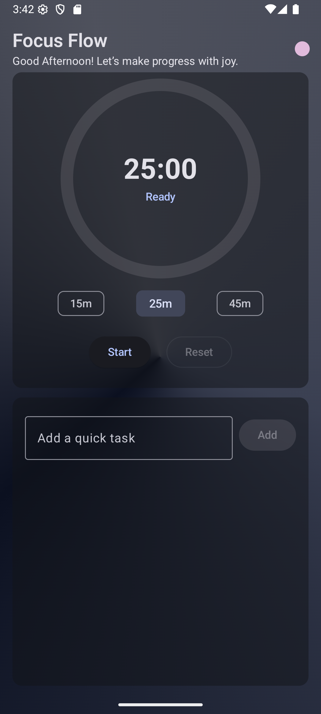
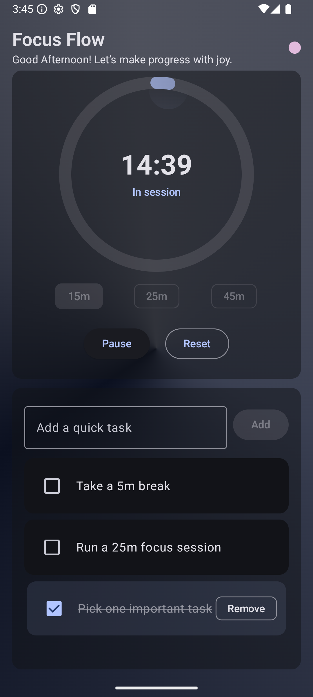
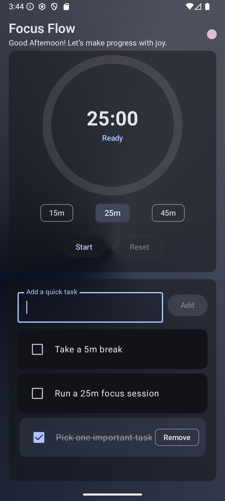

# ⏳ Focus Flow

> *A beautiful, animated Pomodoro‑style focus timer with persistent tasks, playful interactions, and a soothing gradient backdrop — built entirely with Jetpack Compose + Material 3.*

---

## ✨ Features

- 🎨 **Modern UI** — Crafted with Jetpack Compose and Material 3.
- 🖼 **Dynamic Themes** — Supports light, dark, and Android 12+ dynamic colors.
- ⏱ **Pomodoro Timer** — Customizable focus durations with animated progress ring.
- 🎉 **Playful Animations** — Confetti bursts, wobbly chips, bouncy transitions.
- 📝 **Persistent Task List** — Backed by Room to survive app restarts.
- 🚀 **Smooth Splash Screen** — Android 12+ API with graceful exit animation.

---

## 📸 Screenshots

| Home Screen | Timer Running | Task List |
| ----------- | ------------- | --------- |
|  |  |  |

---

## 🛠 Tech Stack

- **Language:** Kotlin 🛠
- **UI:** Jetpack Compose
- **Architecture:** MVVM + ViewModel + StateFlow
- **Persistence:** Room
- **Animation:** Compose Animation APIs (AnimatedVisibility, infinite transitions, custom Canvas animations)
- **Splash:** AndroidX Core SplashScreen API

---

## 📦 Setup

1. **Clone the repo**
   ```bash
   git clone https://github.com/MiteshVasoya/Focus-Flow.git
   ```
2. **Open in Android Studio** (Giraffe or newer recommended).
3. **Sync Gradle** — ensure you have the correct Kotlin + Compose versions.
4. **Run on device/emulator** — minimum SDK 23.

---

## ⚙ Configuration

You can tweak:

- **Default durations** in `DurationChips`.
- **Colors** in `colors.xml`.
- **Confetti palette** in `generateParticles()`.

---

## 🚀 Roadmap

- 📊 Stats screen for completed sessions
- 🔔 Customizable notifications
- 🌐 Multi‑language support

---

## 🤝 Contributing

Contributions, issues, and feature requests are welcome! Feel free to check the [issues page](https://github.com/MiteshVasoya/Focus-Flow/issues).

---

## 📜 License

This project is licensed under the [MIT License](LICENSE).

---

Made with ❤️ in Kotlin